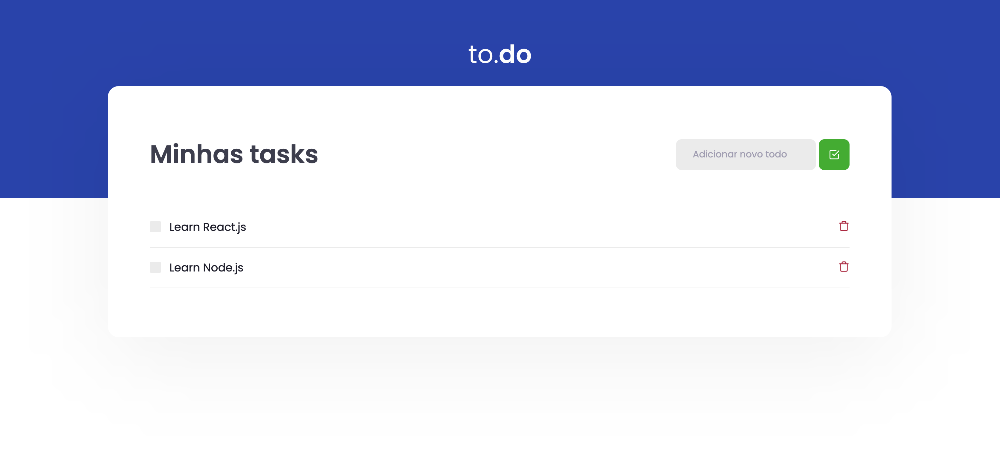

# ReactJS Fundamentals

In this module we built the basic structure of a ReactJs application, using
tools like Webpack, Babel, Webpack Dev Server, SASS, Source Maps, Fast Refresh,
and important concepts as components, properties, state and hooks, and usage of Typescript to add static typing to the application. 

# Module Program

1. Configuring the ambient
2. Important Concepts
3. HTTP Calls
4. Using Typescript
5. Finalizing Application

# To-do App



In this module we built an to-do app called to.do, with no data persistence, wich permits: 
1. Create a to-do activity 
2. Delete a to-do 
3. Finish a to-do 
4. Unfinish a to-do concluded

# Running this project

To run this project first you will need to install yarn packages using the command:
```
yarn
```
Then, to start the application run:
```
yarn dev
```

